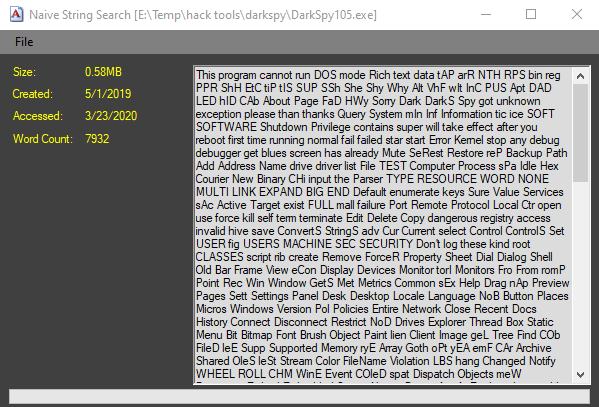

# NaiveStringSearch
How would you search a string for any word in the English language?

Wikipedia defines a Naive String Search as 'A simple and inefficient way to see where one string occurs inside another is to check each place it could be, one by one, to see if it's there. So first we see if there's a copy of the needle in the first character of the haystack; if not, we look to see if there's a copy of the needle starting at the second character of the haystack; if not, we look starting at the third character, and so forth.'

This is mainly an algorithm exercise.

The deal with string search algorithms is they presuppose the word or substring you're searching for is something known. Like search 'absdecatfffjrkk' for an occurrence of 'cat.' But suppose we opened a binary file and read all the bytes from it into a long string. How would we scan through the entire thing and see if there are any readable English-language words present? Somehow we need to proceed through the string of bytes and test each combination of chars against the NetSpell library to see if any combination matches a known word.

</img> 
